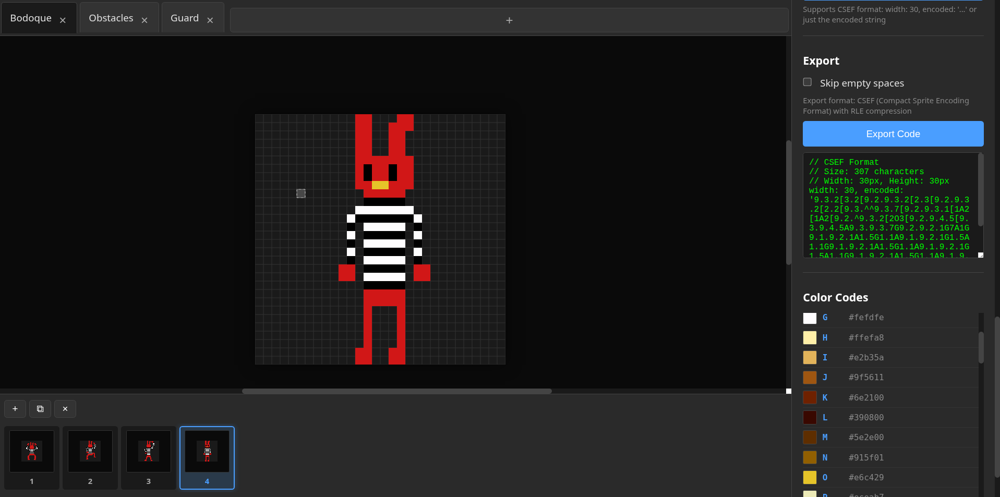

# Sprites editor

A simple editor created only for this hackathon.

The idea is to export my sprites in the most compressed format possible, for this,
I designed the "Platanus Compact Sprite Encoding Format" (PCSEF) to encode the
sprites in the less amount of characters possible.

The WORST we can do is to encode our sprites as a matrix. It is an incredible
waste of space. PCSEF aims to fix this by using RLE encoding plus some semantic
codes to further compress repeated structures.

## Formal specification

```txt
PCSEF is a space-efficient text-based encoding designed to represent 2D pixel sprites. It is optimized for compactness rather than readability and assumes that both encoder and decoder know the sprite’s fixed width (for example, 30 pixels). The format eliminates explicit line separators and uses run-length encoding (RLE) combined with optional semantic codes to further compress repeated structures.

A sprite is represented as a single continuous ASCII string without any line breaks. Each sprite consists of a sequence of tokens. Each token represents a contiguous run of identical pixels, encoded as a run length followed by a color or control code.

Each token follows the pattern <L><C>, where <L> is a single decimal digit from '1' to '9' representing the number of consecutive pixels in the run, and <C> is a single character from the encoding alphabet. The alphabet consists of 95 printable ASCII characters. The characters '0' through '9' are reserved for numeric run-length encoding and semantic codes, while all remaining characters (letters, symbols, punctuation) may be assigned to represent color values. This allows up to approximately 80 usable color codes.

Runs longer than nine pixels are represented by multiple consecutive tokens with the same color code. For example, a run of 16 pixels of color 'A' is encoded as "9A7A". Each run must contain at least one character and must explicitly specify its run length.

No explicit line or row delimiters are stored in the encoded data. The sprite’s width is known implicitly during decoding (for example, 30 pixels per row). The decoder reconstructs the 2D layout by grouping every N decoded pixels (where N equals the sprite width) into a new row. The encoded data therefore represents a flattened raster in left-to-right, top-to-bottom order.

The format defines three optional semantic codes to optimize for repeated patterns. The character '~' indicates a totally empty row. The character '^' indicates repetition of the previous entire row. When the decoder encounters the token '^', it repeats the most recently reconstructed row exactly once, adding it to the output. The character '>' designates horizontal mirroring of the current partially decoded row. When the decoder encounters '>' within a row, it must immediately fill the remainder of that row by appending a reversed copy of the pixels that have already been decoded for that same row. This operation effectively mirrors the left half of the row to produce a horizontally symmetric right half. The '>' symbol may only appear once per row and must always occur after decoding at least half of the row's width. If the sprite's width is even, the mirrored portion has exactly the same number of pixels as the existing portion. If the width is odd, this cannot be applied. The '>' symbol must never appear at the start of a row, after a complete row, or inside a semantic-only row such as one defined by '~' or '^'. Its appearance in any other position is invalid and constitutes a decoding error. This rule allows any horizontally symmetric row to be represented by encoding only its left half followed by a single '>' marker, reducing data size by up to fifty percent for those rows while maintaining deterministic and reversible decoding. These semantic codes are optional and may be omitted if not needed.

Spaces are not required in the encoded stream. If an empty pixel is part of the sprite (for example, background or transparent color), it should be represented by a dedicated color code (such as '.'), rather than by literal whitespace characters. All characters in the encoded string are meaningful; whitespace is not allowed unless explicitly defined as a color code.

The color codes are obtained from an alphabet of printable ASCII characters, except for the digits '0' through '9' and the semantic codes '~', '^', and '>'.

We currently use the following alphabet:

const COLOR_CHARS = 'ABCDEFGHIJKLMNOPQRSTUVWXYZabcdefghijklmnopqrstuvwxyz!@#$%&*()_+-=[]{};:,./<>?`"';

To summarize, the PCSEF encoding process operates as follows. First, remove all line delimiters from the original sprite data. Then, scan the flattened pixel sequence from left to right, counting consecutive identical pixels. For each run, output the run length as a single digit followed by the color code. If a run length exceeds nine pixels, emit multiple tokens. Optionally, compress repeated rows with the '^' symbol, totally empty rows with the '~' symbol, and horizontally symmetric rows (for even widths) by encoding only the left half followed by the '>' symmetry marker. The resulting string represents the entire sprite in a compact form suitable for storage or transmission.

Decoding reverses the process. The decoder reads the string two characters at a time. For each token, it repeats the specified color for the given run length and appends the result to the pixel buffer. Whenever a semantic code is encountered, the decoder applies the corresponding logic: '~' creates an empty row, '^' repeats the previous row, and '>' mirrors the left half of the current row to complete it (only valid for even widths and when at least half the row has been decoded). After processing the entire stream, the decoder splits the buffer into consecutive rows of fixed width to reconstruct the original 2D sprite.
```



In PCSEF, the above sprite is encoded as:

```txt
9.3.2[3.2[9.2.9.3.2[2.3[9.2.9.3.2[2.2[9.3.^^9.3.7[9.2.9.3.1[1A2[1A2[9.2.^9.3.2[2O3[9.2.9.4.5[9.3.9.4.5A9.3.9.3.7G9.2.9.2.1G7A1G9.1.9.2.1A1.5G1.1A9.1.9.2.1G1.5A1.1G9.1.9.2.1A1.5G1.1A9.1.9.2.1G1.5A1.1G9.1.9.2.1A1.5G1.1A9.1.9.1.2[1.5A1.2[9.9.1.2[1.5G1.2[9.9.4.5A9.3.9.4.5[9.3.^9.4.1[3.1[9.3.^^^^9.3.2[2.2[9.3.^
```

Which is 307 bytes, compared to the 900 bytes of the original sprite.
